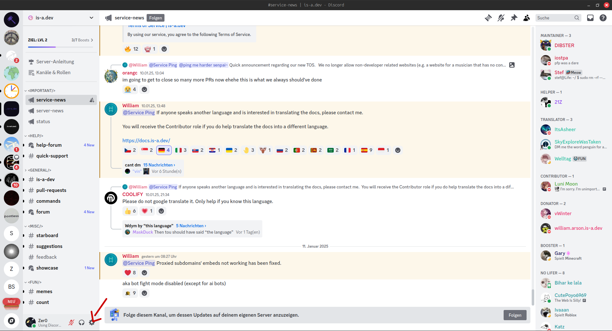
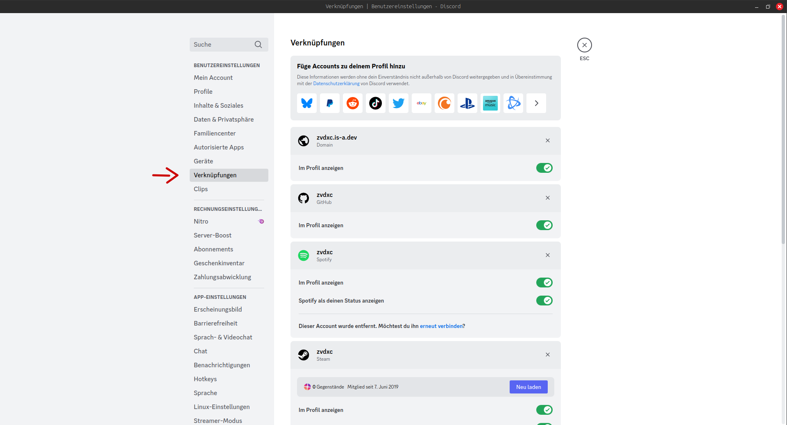
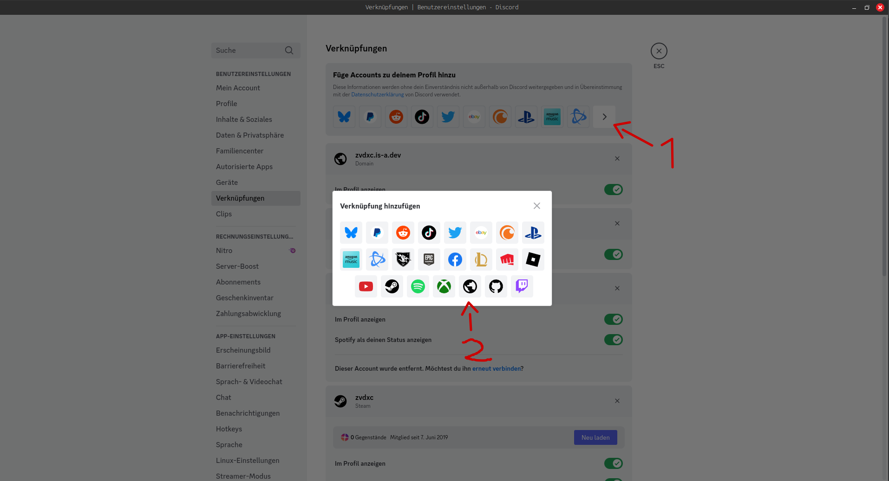
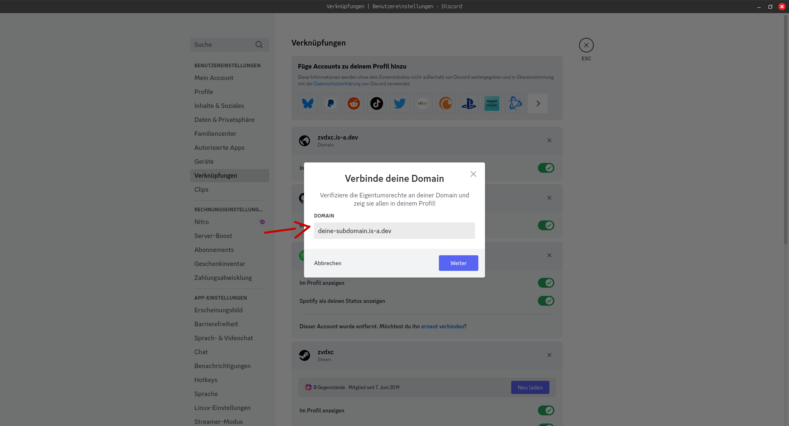
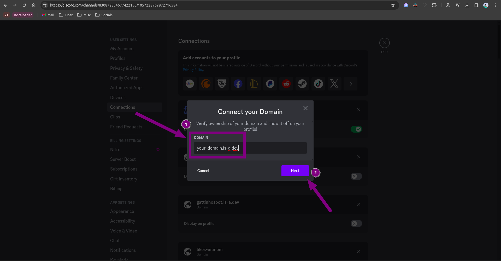

# Discord mit is-a.dev verbinden


1. Öffne deine Discord-App und klicke auf`Nutzereinstellungen`.
   

2. Öffne "Verknüpfungen"
   

3. Klicke `Mehr anzeigen`, danach den Globus.
   

4. Gebe deinen Domainnamen ein (z.B. `deine-subdomain.is-a.dev`).
   

5. Klicke auf `Kopieren` im Inhaltsfeld.
   

### Die Domain-Datei erstellen

Erstelle eine JSON-Datei im `domains/` Ordner namens `_discord.deine-subdomain.json` mit diesem Inhalt:

```json
{
    "owner": {
        "username": "github-nutzername",
        "email": "deine@email.addresse"
    },
    "record": {
        "TXT": "dein-kopierter-text"
    }
}
```

## Konfiguration


Nachdem dein PR akzeptiert wurde wiederhole die Schritte vorher und drücke `Verifizieren`. Wenn ein Fehler erschein, warte 24 Stunden, damit die DNS-Änderungen greifen.