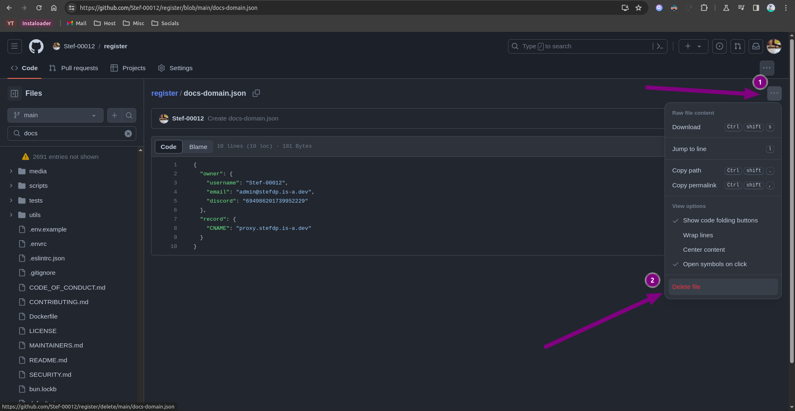
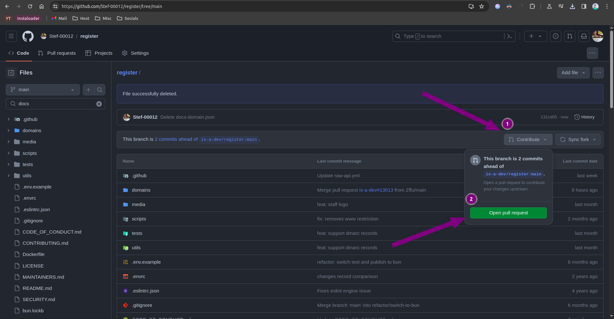

# How to delete your is-a.dev domain

## Open your fork of the [is-a-dev/register](https://github.com/is-a-dev/register) repository

1. Open your fork, or if you deleted it, [fork](https://github.com/is-a-dev/register/fork) the repository once again.
2. Find your domain file in the `domains/` folder (e.g. `/domains/myname.json`)
3. Press the 3 dots and press the `Delete file` button.

4. Press `Commit changes`.

5. In the popup that appears, press `Commit changes` once again.

6. Click the `Contribute` button, then press `Open pull request`.

7. Press `Create pull request` again.

And you're done! After you pull request has been merged, the domain will be deleted.