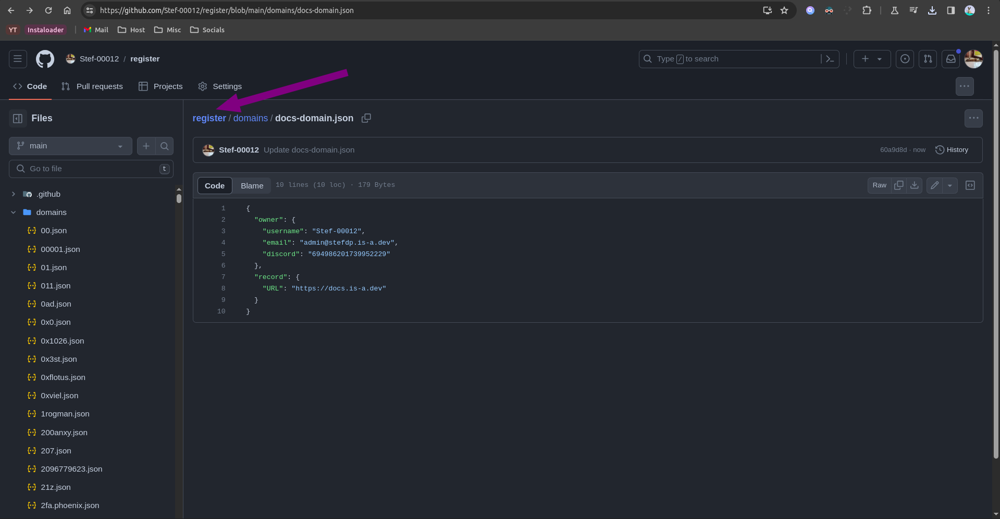
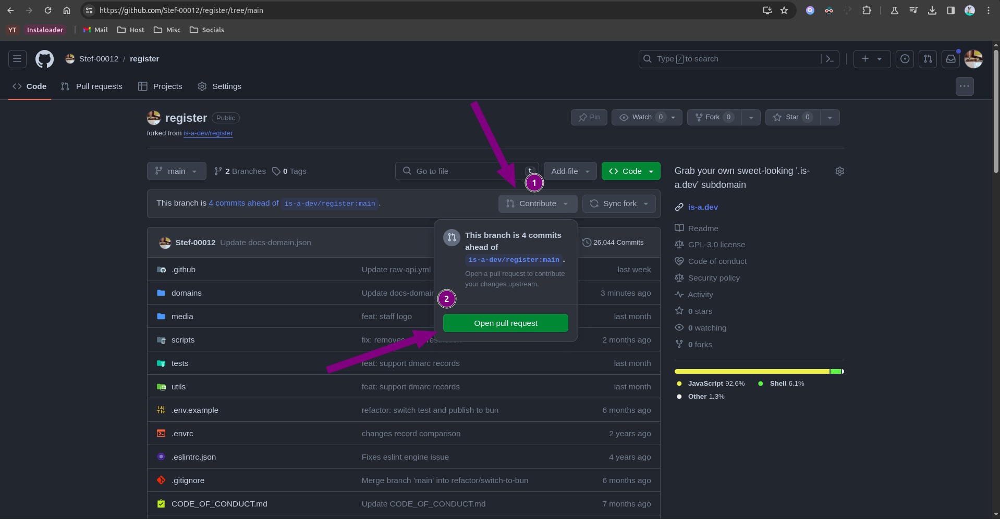

# How to delete your is-a.dev domain

## Open your fork of the [is-a-dev/register](https://github.com/is-a-dev/register) repository

1. Open your fork, or if you deleted it, [fork](https://github.com/is-a-dev/register/fork) again the repository
2. Find you domain file in the `domains` folder (`/domains/<subdomain>.json`)
3. Press the "Edit this file" button (a pencil icon)

4. Apply your changes in the text field and then press the "Commit changes" button

5. In the popup that appears, press the button "Commit changes"

6. Press on the "register" text to go back to the home of the repository

7. Press the "Contribute" button and then press on the "Open pull request" button

8. Press the "Create pull request" button

9. Add a title to your pull request and then press the "Create pull request button"

And you're done! After you pull request has been merged, the domain will be updated