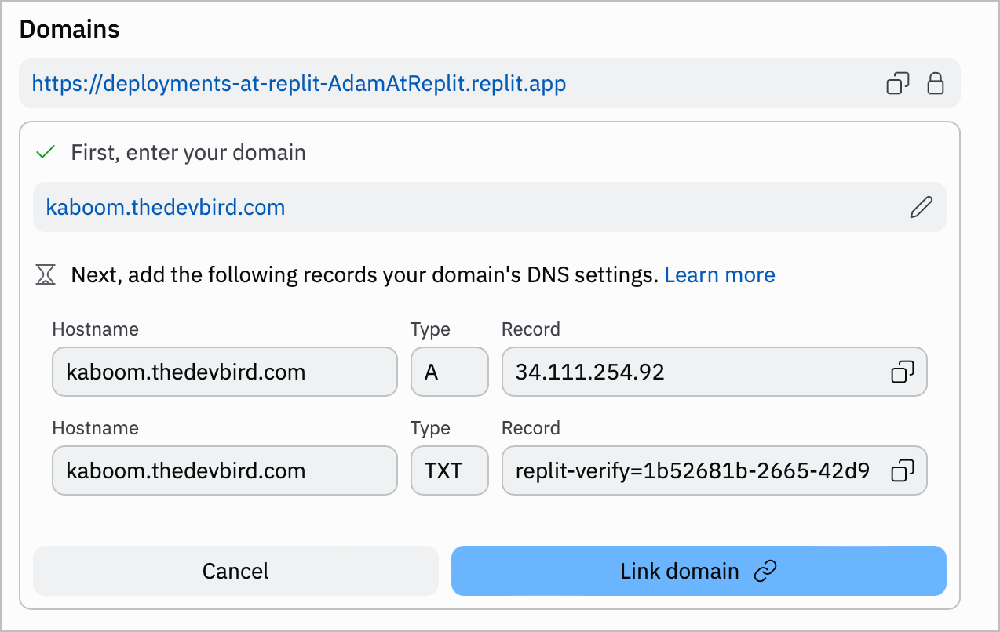

# Setting up Replit with your is-a.dev subdomain

## Creating a project
Follow the instructions in the [Replit Workspace Guide](https://docs.replit.com/programming-ide/introduction-to-the-workspace#how-to-create-a-repl) on how to create a project.

<!-- You need replit core, since they have a limit to 3 workspaces on free account, and deployment needs to be purchased also -->
## Connect your repl to your is-a.dev subdomain
Since Replit Workspaces has changed alot, follow the instructions in the [Replit Deployment Custom Domains Guide](https://docs.replit.com/cloud-services/deployments/custom-domains). You may need the Replit Deployment subscription to do so

## Creating the domain file
After clicking "Link a Domain" button on your Replit Deployment menu and already typed the domain, you will see this

(The example screenshot uses their own domain, `kaboom.thedevbird.com`. But in our case, it should be `<subdomain>.is-a.dev`)

Create a JSON file inside `domains` directory (`domains/<subdomain>.json`) and submit a pull request:

<!-- They are now using TXT for verification, not just `replit-user=cupglassdev`. When deleted, you cant use it in replit -->
```json 
{
    "owner": {
        "username": "<github-username>",
        "email": "<email@address>",
        "twitter": "<twitter-username>"
    },
    "record": {
        "A": ["<IP here, listed on the A Record>"],
        "TXT": "<TXT value here, listed on the TXT Record>"

    }
} 
```
<!-- as EducatedSuddenBucket's suggestion -->
Make sure to provide the preview on the pull request (not on your JSON files)

Note: In the owner section, you can add any social media handle, such as Discord. If you add another social media account, you can omit the email and Twitter fields. However, the GitHub username is mandatory. Don't forget to provide a preview of your site in your pull request.

## Configuring
- After your pull request has been merged into the main repository you should be able to visit your new is-a.dev domain and it should show you your replit site,
if it doesn't then you have configured your domain wrong.
