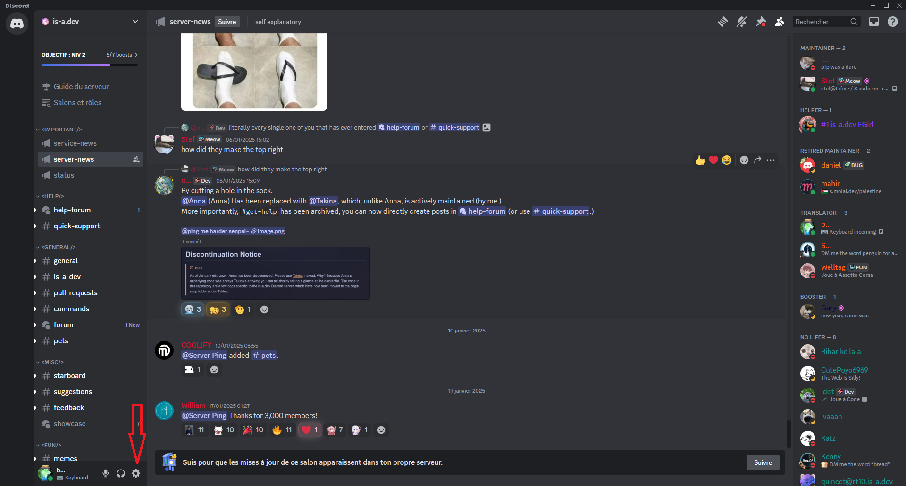
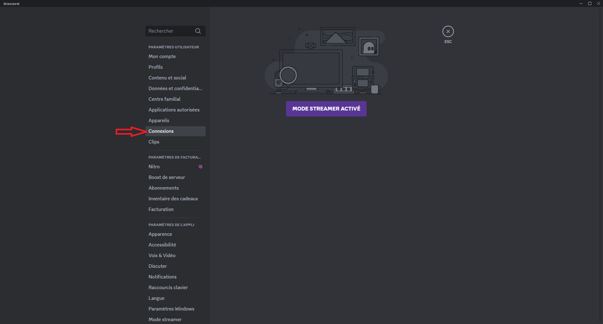
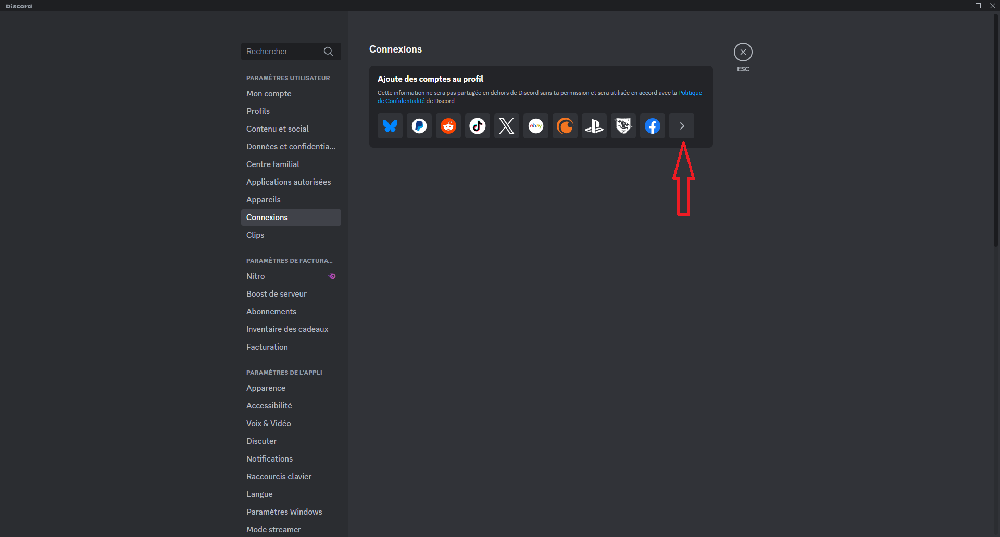
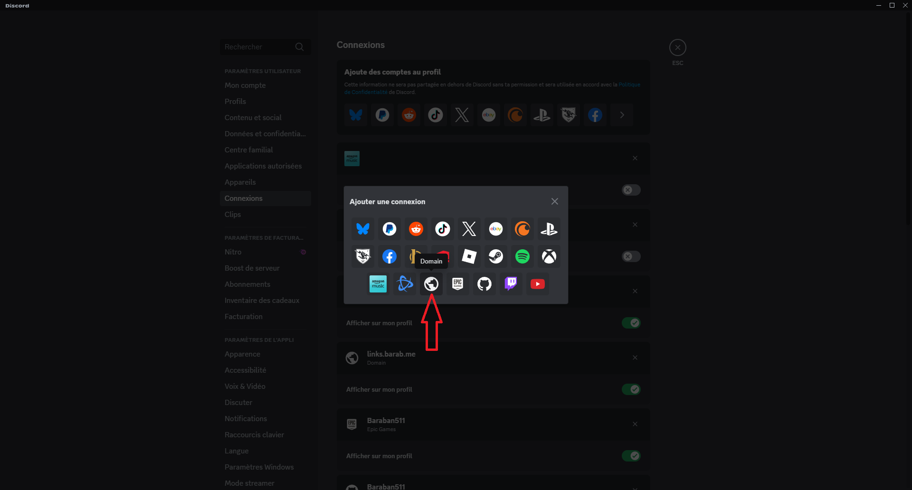
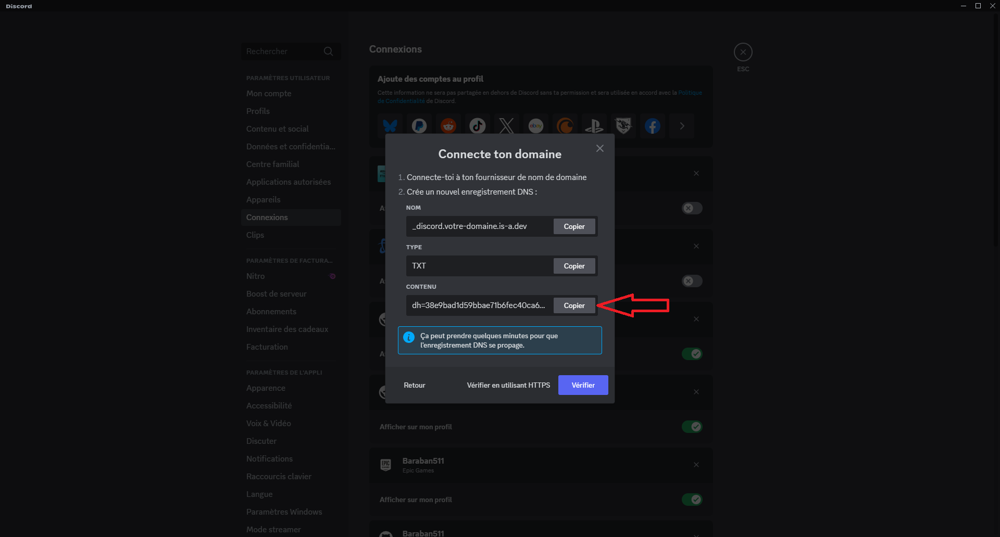

# Ajouter votre domaine is-a.dev à votre profil Discord
## Récupérez votre texte de vérification

1. Ouvrez votre application Discord et sélectionnez `Paramètres`.
   

1. Ouvrez la section `Connections`.
   

1. Pressez le bouton `Voir plus`.
   

1. Cliquez sur le globe (bouton domaine)
   

1. Dans le champ qui apparait, insérez votre domaine is-a.dev (e.g. `example.is-a.dev`).
   

1. Récupérez votre texte de vérification
   

### Créer le fichier de domaine

Créez dans le dossier `domains/` un fichier JSON appelé `domains/_discord.example.json` contenant le texte suivant :

```json
{
    "owner": {
        "username": "github-username",
        "email": "email@address"
    },
    "records": {
        "TXT": "discord-verification-string"
    }
}
```

## Configuration

Après que votre Pull Request ait été fusionnée, refaite les étapes pour obtenir le texte de vérification et cliquez sur le bouton `Vérifier`.
Si l'erreur *"Impossible de vérifier votre domaine"* apparait, attendez quelques minutes (parfois jusqu'à 24 heures) la mise à jour du DNS.
