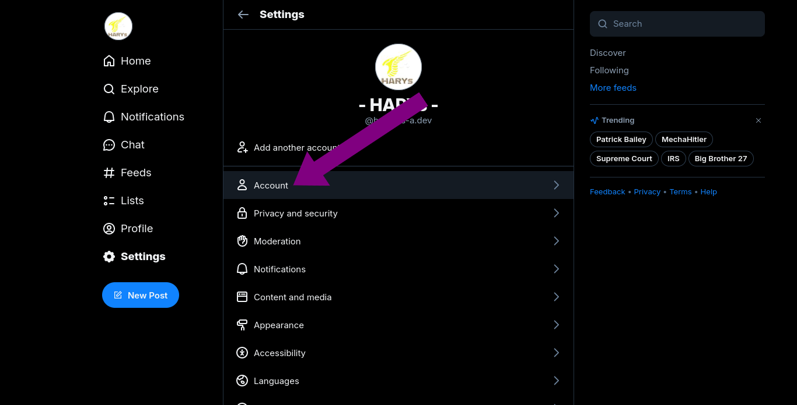
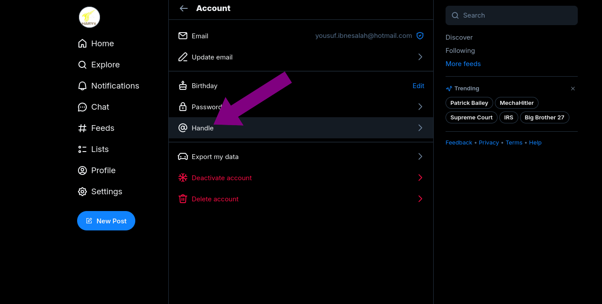
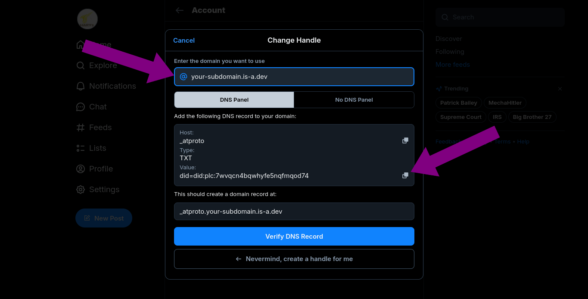

# Setting up a Bluesky custom handle with an is-a.dev subdomain

## Get your verification string

1. Open your Bluesky app and go to your profile **Settings**.

   

2. Open the **Accounts** page.

   

3. Go to the **:icon-mention: Handle** settings.

   

4. Click on the "I have my own domain" button.

   

5. **Enter** your is-a.dev domain name in the text input and then **Copy** the TXT string. (e.g. `your-subdomain.is-a.dev`).

   


### Create your domain file

Create a JSON file inside the `domains/` directory called `domains/_atproto.your-subdomain.json` with the following content and open a pull request:

```json
{
    "owner": {
        "username": "your-github-username"
    },
    "records": {
        "TXT": "bsky-verification-string"
    }
}
```

> [!NOTE]
> Don't forget the comma right above the `"records"` key!

## Configuration

After your pull request has been merged, repeat steps 1-5 and press the `Verify DNS Record` button.
If it shows any error such as `Failed to verify handle. Please try again.`, try waiting a few minutes (sometimes up to 24 hours) as the DNS records may not have propagated yet.
