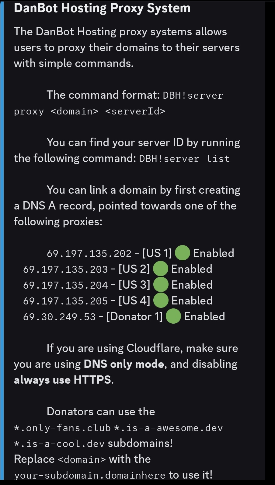
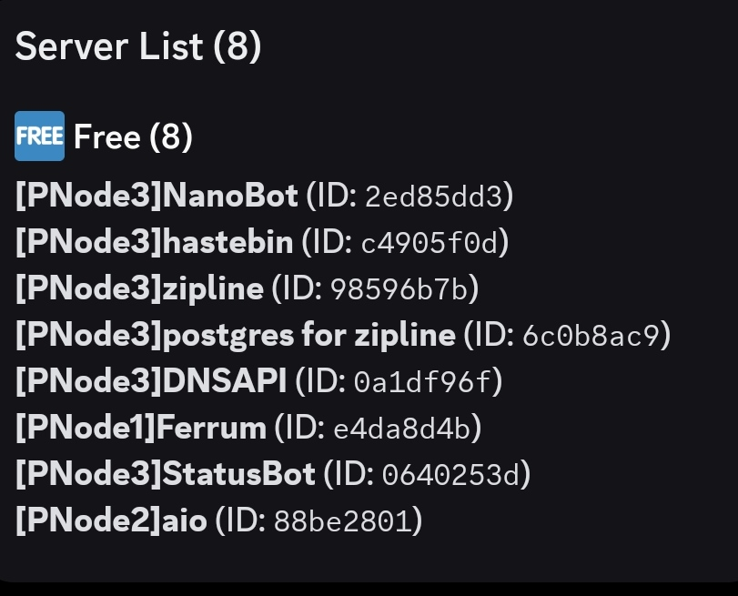

!!!danger
This hosting provider has changed a lot in recent times, so this guide may not be up to date with the current system the hosting provider has.
!!!

# Setting up DanBot Hosting with an is-a.dev subdomain

This guide will walk you through the process of setting up a DanBot Hosting website and pointing your is-a.dev subdomain to it.

## Getting Proxy IP

Execute the following command in [DanBot Hosting Discord server](https://discord.gg/dbh) in the `#commands` channel.

```
dbh!server proxy
```

You will get a reply like this:



If you are on a free plan, choose any US proxy or you can use the Donator Proxy If you are a Donator, note the IP address of the proxy you chose.

### Creating the domain file

Create a JSON file inside `domains` directory (`domains/subdomain.json`) with the following content and submit a pull request:

```json
{
    "owner": {
        "username": "github-username",
        "email": "me@example.com"
    },
    "records": {
        "A": ["proxy-ip-here"]
    }
}
```

**Note:** In the owner section, you can add any social media handle, such as Discord. If you add another social media account, you may omit the email field. However, the GitHub username is mandatory. Don't forget to provide a preview of your website in your pull request.

### Opening a Pull Request (PR)

Once you have made a new file or made changes to an existing file, you can create a pull request. open creating a pull request you will see a default pull request message which should show:

```
<!--
YOU MUST FILL OUT THIS TEMPLATE FOR YOUR PR TO BE ACCEPTED!
-->

# Requirements
<!-- Your domain MUST pass ALL the requirements below, otherwise it WILL BE DENIED. -->
<!-- Change each checkbox to [x] (all lowercase, with no spaces between the brackets) to mark it as completed. -->

- [ ] I **agree** to the [Terms of Service](https://is-a.dev/terms). <!-- Your request MUST follow the TOS to be approved. -->
- [ ] My file is following the [domain structure](https://docs.is-a.dev/domain-structure/). <!-- Your JSON file is in the domains directory, the name is valid, etc. -->
- [ ] My website is **reachable** and **completed**. <!-- We do not permit simple "Hello, world!" or simply copied template websites with minimal changes. -->
- [ ] My website is **software development** related. <!-- Only your root subdomain needs to meet this requirement. -->
- [ ] My website is **not for commercial use**. <!-- Your website's purpose should not be to generate any form of revenue or profit. -->
- [ ] I have provided contact information in the `owner` key. <!-- Provide your email in the `email` field or another platform (e.g. X/Twitter or Discord) for contact. -->
- [ ] I have provided a preview of my website below. <!-- This step is required for your PR to be approved. -->

# Website Preview
<!-- Provide a link AND screenshot of your website below. if not provided your PR will be closed with no questions asked. -->
# Website Purpose
<!-- Please tell us the purpose or motive behind your website. For example, it is a portfolio website, etc. -->

```

Once you seer the pull request message, replace all the "[ ]" with a lowercase "x" such that it looks like "[x]". Also provide the link to your current site with a screenshot of the site preview and provide the purpose of the site.

## Configuring

After your pull request is merged, get your server ID by running this command:

```
dbh!server list
```

You will get a reply like this:



Note down the server ID, then execute following command:

```
dbh!server proxy your-subdomain.is-a.dev yourserverid
```
