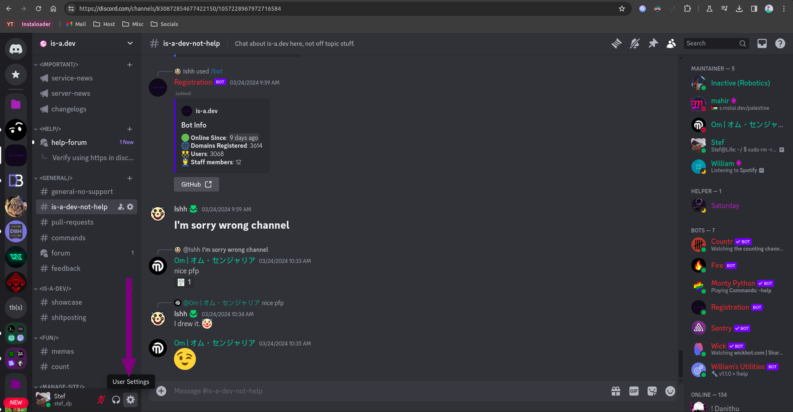
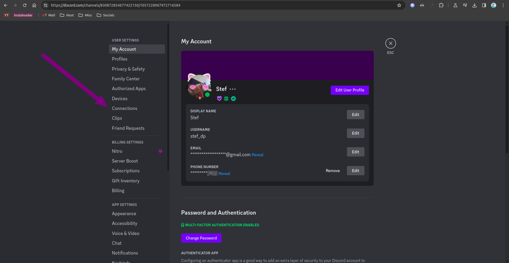
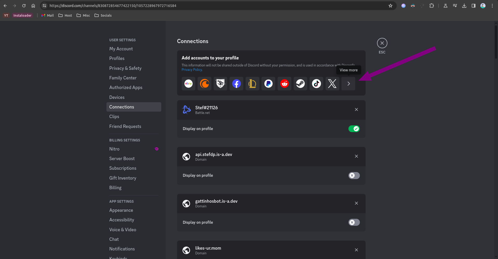
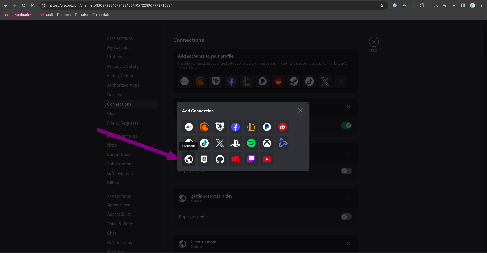
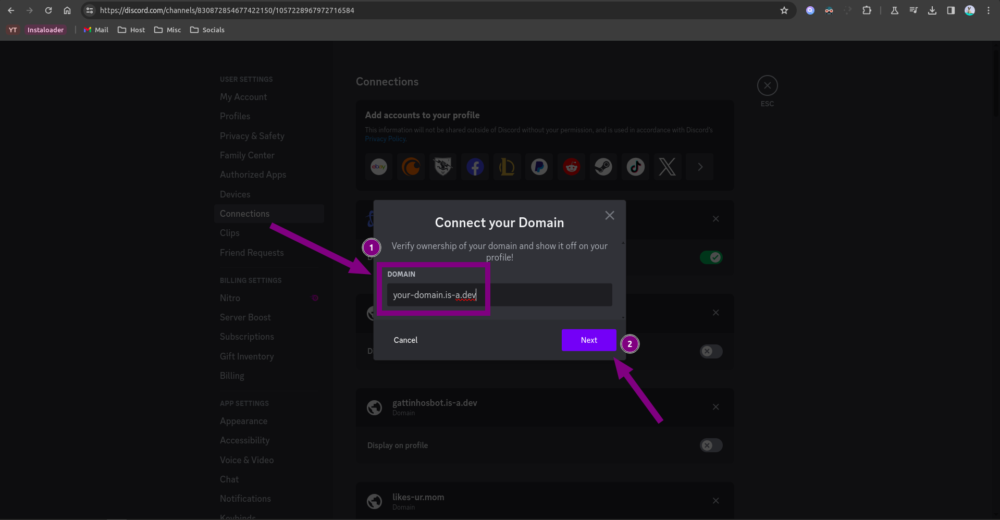
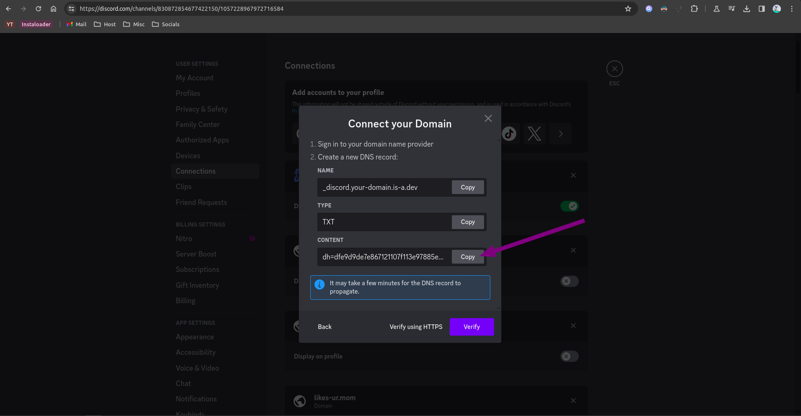

# Setting up Discord domain connection with your is-a.dev subdomain

## Get your verification string

1. Open your Discord app and press `Settings`.
   

2. Open the `Connections` section.
   

3. Press the `View more` button.
   

4. Click on the domain button (the globe icon).
   

5. In the field that appears type your is-a.dev domain name (e.g. `your-domain.is-a.dev`).
   

6. Copy the verification string.
   

### Create your domain file

Create a JSON file inside the `domains/` directory called `domains/_discord.your-domain.json` with the following content:

```json
{
    "owner": {
        "username": "your-github-username"
    },
    "records": {
        "TXT": "discord-verification-string"
    }
}
```

**Note:** Don't forget the comma right above the `"records"` key!

### Opening a Pull Request (PR)

Once you have made a new file or made changes to an existing file, you can create a pull request. open creating a pull request you will see a default pull request message which should show:

```
<!--
YOU MUST FILL OUT THIS TEMPLATE FOR YOUR PR TO BE ACCEPTED!
-->

# Requirements
<!-- Your domain MUST pass ALL the requirements below, otherwise it WILL BE DENIED. -->
<!-- Change each checkbox to [x] (all lowercase, with no spaces between the brackets) to mark it as completed. -->

- [ ] I **agree** to the [Terms of Service](https://is-a.dev/terms). <!-- Your request MUST follow the TOS to be approved. -->
- [ ] My file is following the [domain structure](https://docs.is-a.dev/domain-structure/). <!-- Your JSON file is in the domains directory, the name is valid, etc. -->
- [ ] My website is **reachable** and **completed**. <!-- We do not permit simple "Hello, world!" or simply copied template websites with minimal changes. -->
- [ ] My website is **software development** related. <!-- Only your root subdomain needs to meet this requirement. -->
- [ ] My website is **not for commercial use**. <!-- Your website's purpose should not be to generate any form of revenue or profit. -->
- [ ] I have provided contact information in the `owner` key. <!-- Provide your email in the `email` field or another platform (e.g. X/Twitter or Discord) for contact. -->
- [ ] I have provided a preview of my website below. <!-- This step is required for your PR to be approved. -->

# Website Preview
<!-- Provide a link AND screenshot of your website below. if not provided your PR will be closed with no questions asked. -->
# Website Purpose
<!-- Please tell us the purpose or motive behind your website. For example, it is a portfolio website, etc. -->

```

Once you seer the pull request message, replace all the "[ ]" with a lowercase "x" such that it looks like "[x]". Also provide the link to your current site with a screenshot of the site preview and provide the purpose of the site.

## Configuration

After your pull request has been merged, repeat steps 1-5 and press the `Verify` button.
If it shows any error such as `Unable to verify your domain`, try waiting a few minutes (sometimes up to 24 hours) as the DNS might not have propagated yet.
