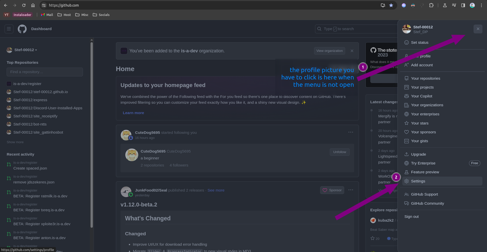
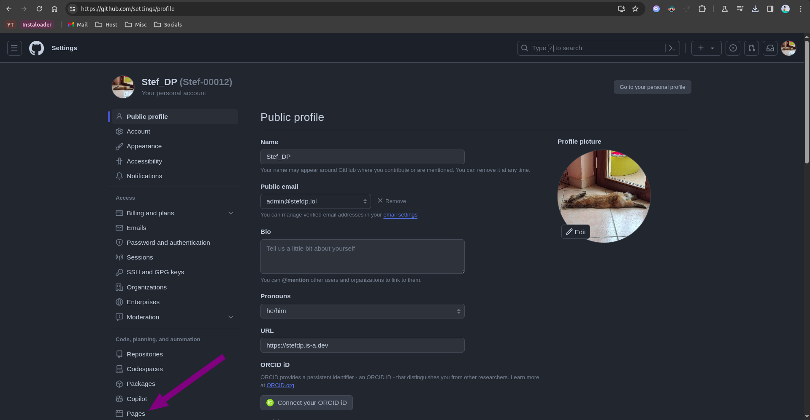
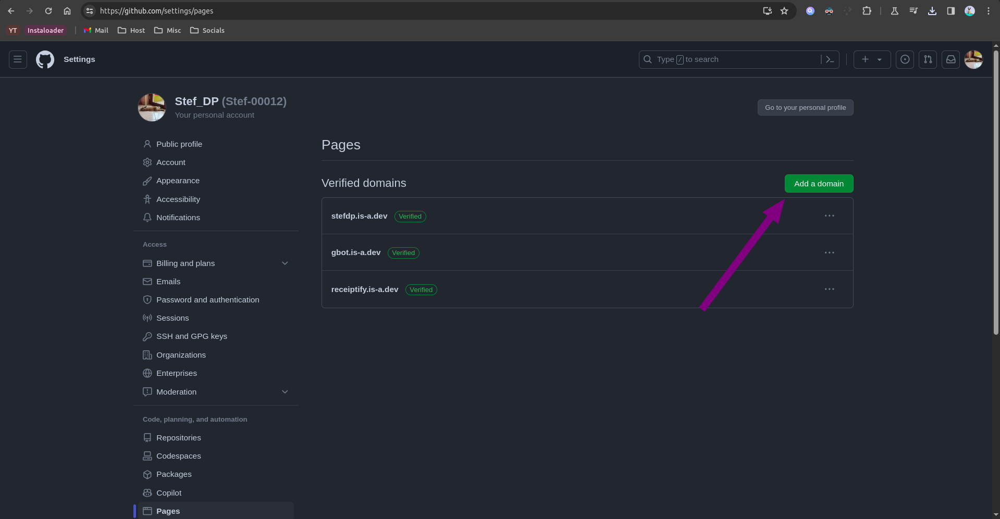
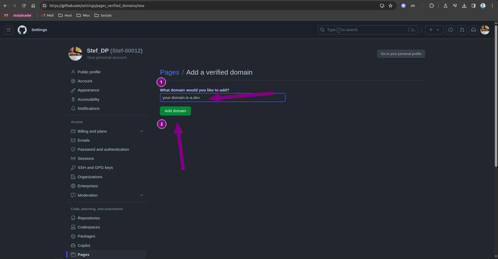
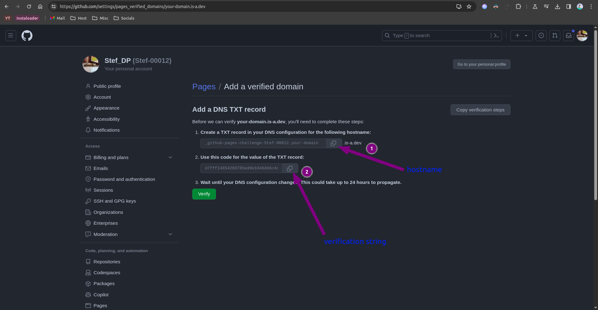

## Setting up GitHub pages with an is-a.dev subdomain

This guide will walk you through the process of setting up a GitHub Pages site and pointing your is-a.dev subdomain to it.

### Creating a GitHub Pages repository

First, you'll need to create a site on GitHub Pages. Follow the instructions in the [GitHub Pages Getting Started Guide](https://docs.github.com/en/pages/getting-started-with-github-pages).

### Creating the domain file

Create a JSON file inside `domains` directory (`domains/subdomain.json`) with the following content and submit a pull request:

```json
{
    "owner": {
        "username": "github-username",
        "email": "me@example.com"
    },
    "records": {
        "CNAME": "github-username.github.io"
    }
}
```

### Configuring

- After the pull request is merged, you may see a **404** error on `subdomain.is-a.dev` or the wrong site. To fix this issue, go to your GitHub pages repository and navigate to: **Settings > GitHub pages > Custom Domain** and add `subdomain.is-a.dev` in the given field. *Only do this **after** your pull request is merged.*
- Check the **Enforce HTTPS** checkbox below the custom domain input.
- Wait some time and your site should be live!

## Verifying your is-a.dev Subdomain with GitHub Pages

### Get your verification string

1. Navigate to GitHub, press your profile icon at the top right, and press `Settings`.



2. Press `Pages`.



3. Press `Add a domain`.



4. In the field that appears, type your is-a.dev subdomain name (e.g. `myname.is-a.dev`) and press `Add domain`.



5. Copy the hostname and the verification string.



### Create the domain file

Create a JSON file inside the `domains/` directory called `domains/hostname.subdomain.json` using the hostname you copied in step 5 and subdomain (`subdomain.is-a.dev`) with the following content and submit a pull request:

```json
{
    "owner": {
        "username": "github-username",
        "email": "your-email@gmail.com"
    },
    "records": {
        "TXT": "github-verification-string"
    }
}
```

### Opening a Pull Request (PR)

Once you have made a new file or made changes to an existing file, you can create a pull request. open creating a pull request you will see a default pull request message which should show:

```
<!--
YOU MUST FILL OUT THIS TEMPLATE FOR YOUR PR TO BE ACCEPTED!
-->

# Requirements
<!-- Your domain MUST pass ALL the requirements below, otherwise it WILL BE DENIED. -->
<!-- Change each checkbox to [x] (all lowercase, with no spaces between the brackets) to mark it as completed. -->

- [ ] I **agree** to the [Terms of Service](https://is-a.dev/terms). <!-- Your request MUST follow the TOS to be approved. -->
- [ ] My file is following the [domain structure](https://docs.is-a.dev/domain-structure/). <!-- Your JSON file is in the domains directory, the name is valid, etc. -->
- [ ] My website is **reachable** and **completed**. <!-- We do not permit simple "Hello, world!" or simply copied template websites with minimal changes. -->
- [ ] My website is **software development** related. <!-- Only your root subdomain needs to meet this requirement. -->
- [ ] My website is **not for commercial use**. <!-- Your website's purpose should not be to generate any form of revenue or profit. -->
- [ ] I have provided contact information in the `owner` key. <!-- Provide your email in the `email` field or another platform (e.g. X/Twitter or Discord) for contact. -->
- [ ] I have provided a preview of my website below. <!-- This step is required for your PR to be approved. -->

# Website Preview
<!-- Provide a link AND screenshot of your website below. if not provided your PR will be closed with no questions asked. -->
# Website Purpose
<!-- Please tell us the purpose or motive behind your website. For example, it is a portfolio website, etc. -->

```

Once you seer the pull request message, replace all the "[ ]" with a lowercase "x" such that it looks like "[x]". Also provide the link to your current site with a screenshot of the site preview and provide the purpose of the site.


### Configuration

After your pull request has been merged, repeat the steps to get the verification string and press the `Verify` button.
If it shows an error such as `Unable to verify your domain`, try waiting a few minutes (sometimes up to 24 hours) as the DNS records may not have propagated yet.
