## Setting up Lovable project with an is-a.dev subdomain

This guide will walk you through the process of making your Lovable Project work on is-a.dev subdomains. Currently Lovable doesn't intergrate directly with is-a.dev, so we have to use GitHub as a proxy with [Cloudflare Pages](/guides/cloudflare-pages) to make this work. We will use the user `doughmination` for this example.

### Connect your project to GitHub

1. Open your project's `More` page, `Settings` tab and navigate to the `Git` tab.
    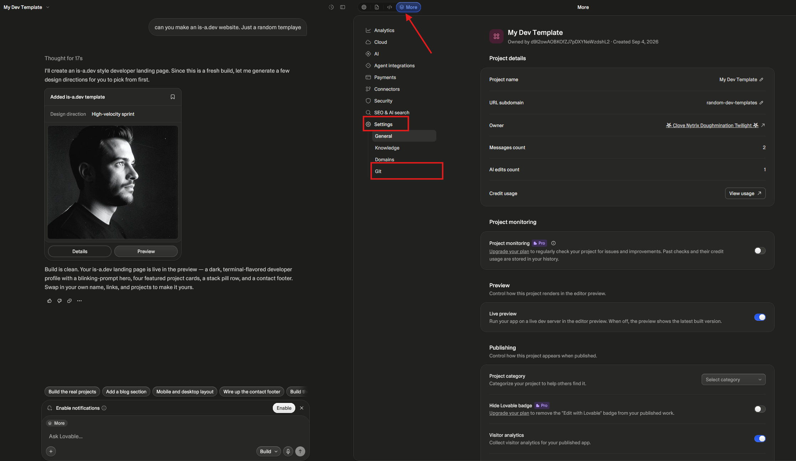

2. Click the `GitHub` button, and `Add Connection`, then `Add Account`.
    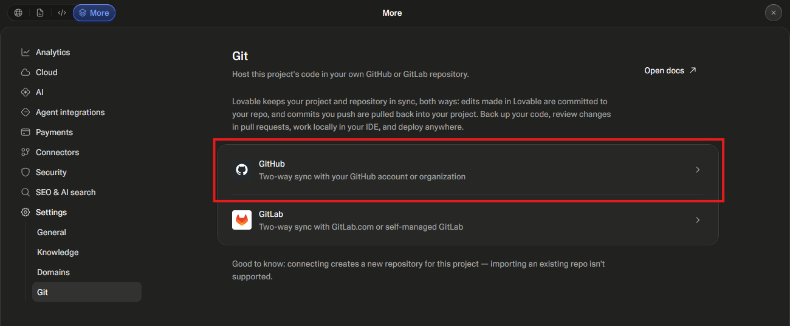 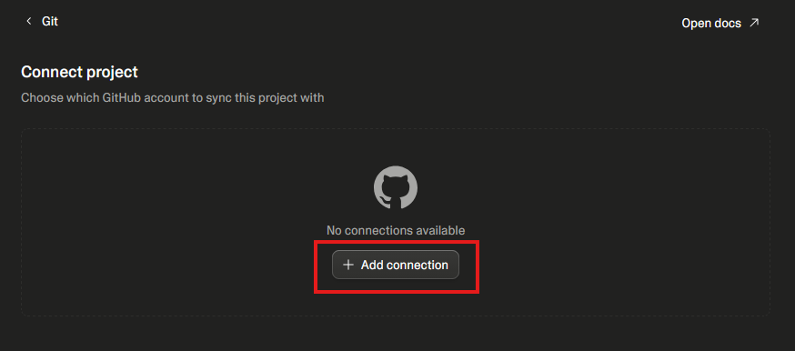
Note: If you login with GitHub, you may already have your account connected

3. Once you connect the account, click `Connect`, which connect to a GitHub repository. 
    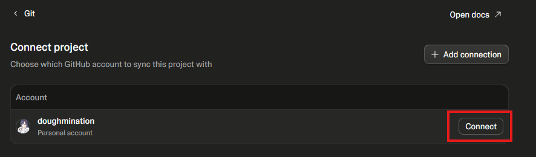

4. You can see it as a recent Private repository. Make a note of the project's name.
    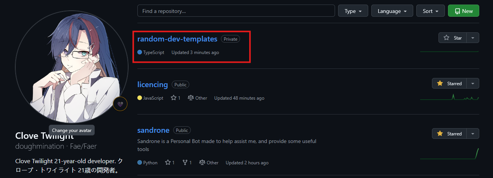

### Connect GitHub to Cloudflare Pages

1. Open Cloudflare and under `Build`, press `Compute`, then `Workers & Pages`.
    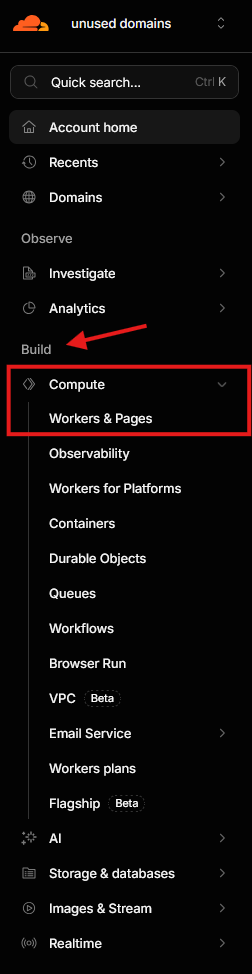

2. Click `Create Application`, and then access Pages via `Continue to Pages`.
    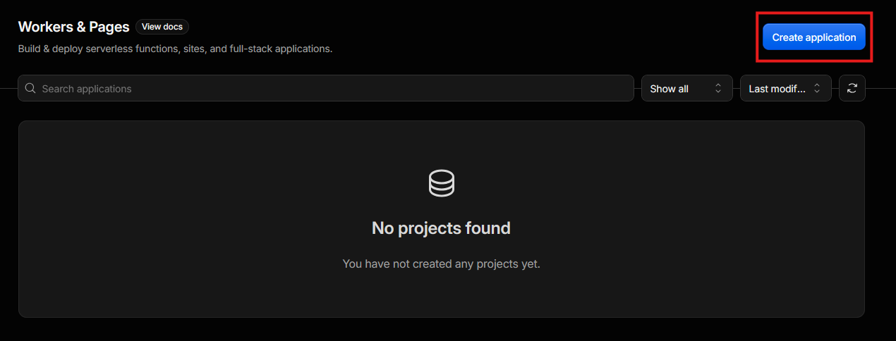 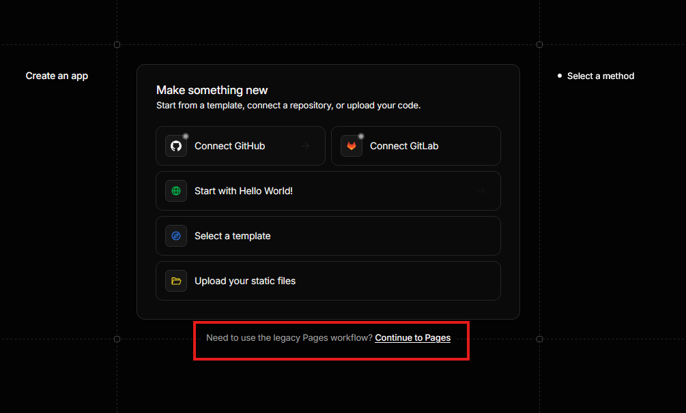

3. Press `Import an existing Git repository` to access your GitHub account.
    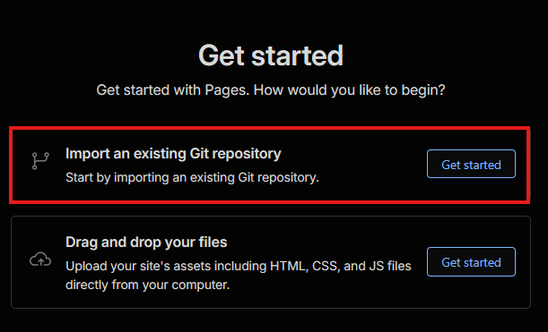

4. Connect GitHub.
    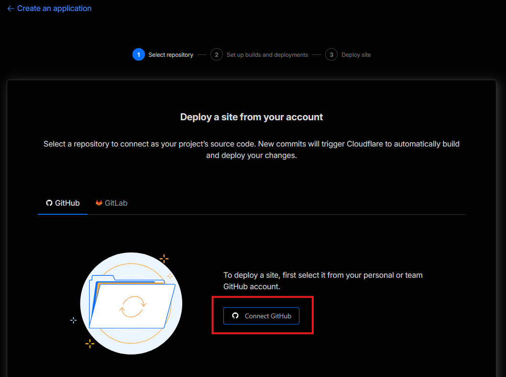 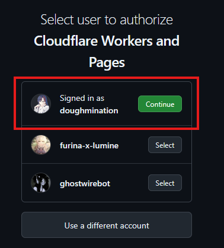

5. Select your project's name, so we can auto-pull from source.
    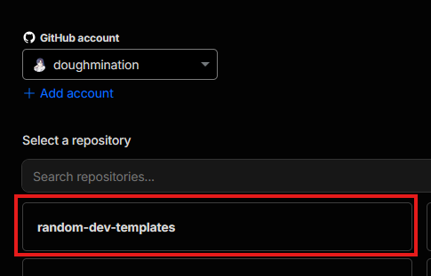

6. Configure the build to the below settings.
    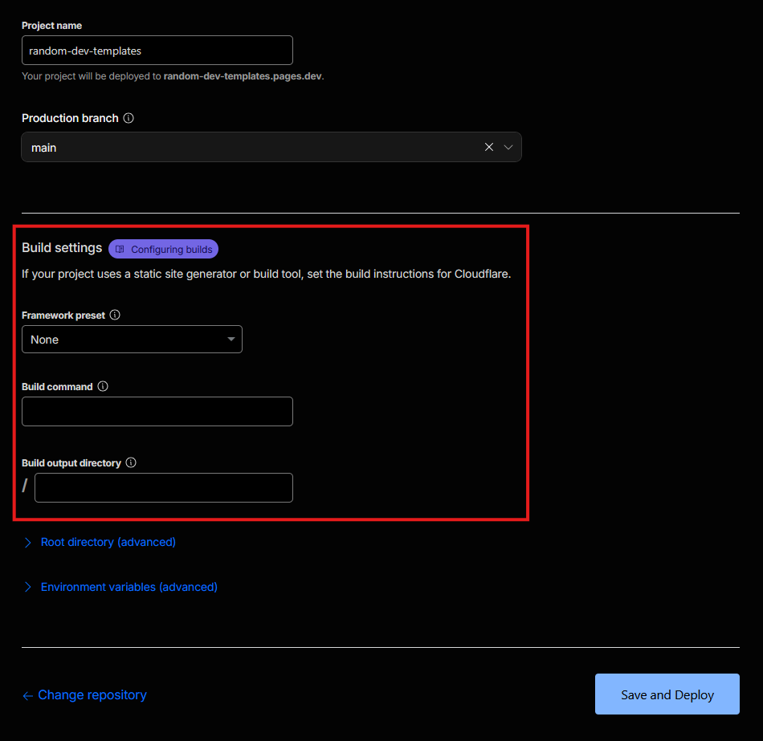 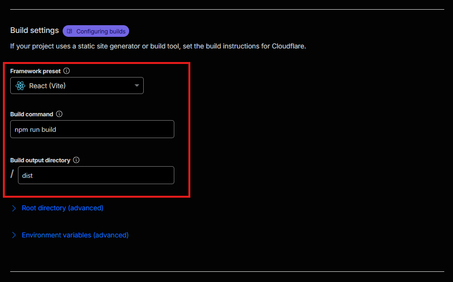

7. Press the `Save and Deploy` button, and carry on the flow.

After the page finishes building, you can now make a PR, for this, please see the [Cloudflare Pages](/guides/cloudflare-pages) guide.