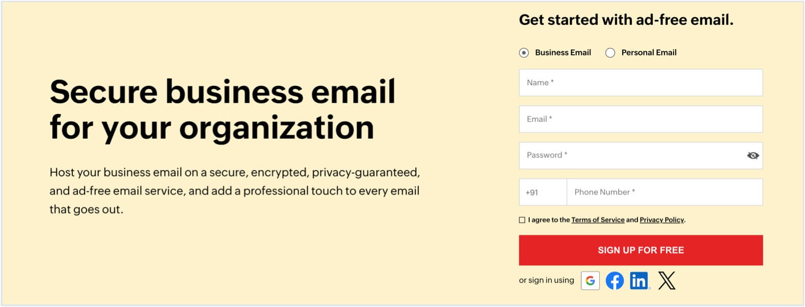
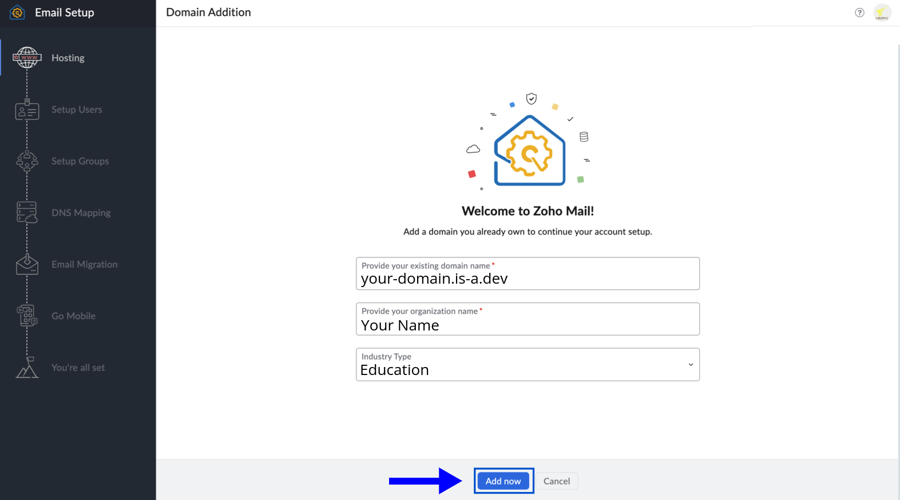
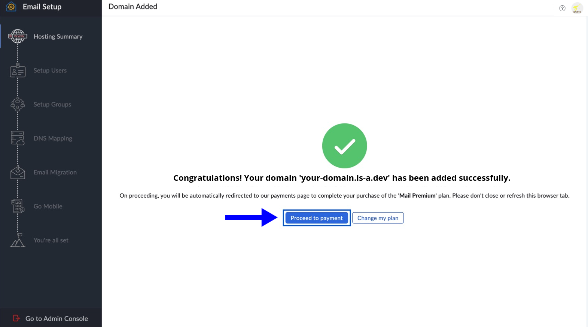
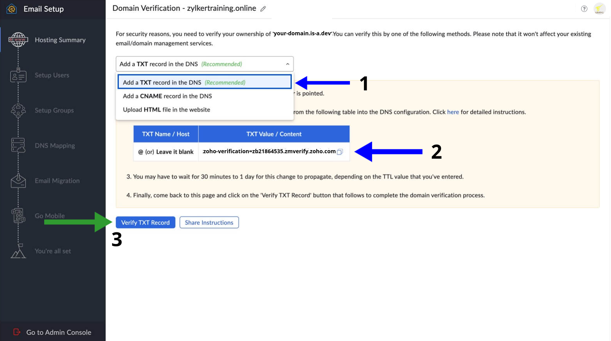
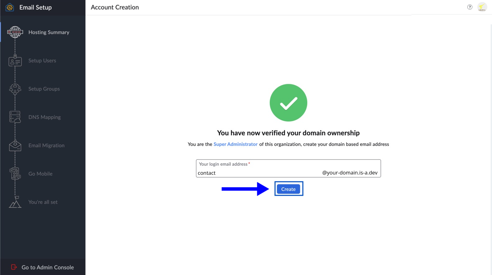
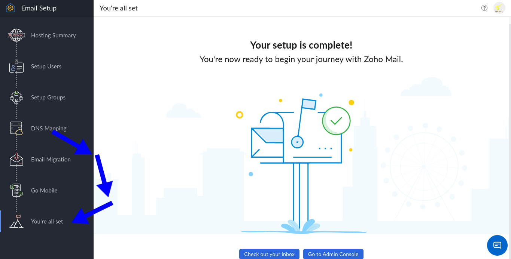

# Setting up Zoho Mail using is-a.dev subdomain

This guide will walk you through the process of setting up custom email in Zoho Mail with your is-a.dev subdomain.

## Getting Started



1. Visit the [Zoho Mail homepage](https://www.zoho.com/mail/), fill in the required details, and click **SIGN UP FOR FREE** to create your account. If you already have one, visit [here](https://www.zoho.com/mail/login.html) to login to your existing account.
2. You must have an is-a.dev subdomain to set up and use Zoho Mail services. Learn more in our [GitHub repository](https://github.com/is-a-dev/register).
3. A valid mobile number and an email address for verification purposes is **required** to access Zoho Mail.

## Verify your domain
After logging in to your Zoho Mail account, follow the steps given to verify your domain ownership.

1. Click **Add now** under the **Add an existing domain** section on the Domain Addition page.

   

2. Enter `your-domain.is-a.dev` subdomain and the name of your organization in the pop-up. The organization name can be your personal name too. Click **Add now** to proceed.

   

3. Once your domain is added, click **Proceed to payment**. If you want to skip this and continue with your free plan, then click **Change my plan**.

   

5. On Zoho's domain setup page, select **Add TXT record to DNS** from the dropdown. It is recommended, but you can also use the last HTML file option for quick setup.

   

   You need to copy the **TXT value / content** and create a new file or update an existing file, for example `your-domain.json`. After that, please open a pull request in [our repository](https://github.com/is-a-dev/register) and **wait for the pull request to be merged**.

   ```json
   {
    "owner": {
        "username": "github-username",
        "email": "example@example.org"
     },
    "records": {
        "TXT": ["Paste TXT Value / Content Here"]
     }
   }
   ```

6. Now that you have verified ownership of your domain, click **Create** to create your first email using your is-a.dev subdomain.

   


## DNS Mapping

After you verified your domain, you may see the **Setup Users** and **Setup Groups** sections, where you can set up your users (such as example@your-domain.is-a.dev) and groups. For now, you can skip these and move on to **DNS Mapping**.

### MX and SPF Records 

1. Now you need to add the **MX** and **SPF records** for your domain. You will need to update the existing file that you used to verify the domain and add the TXT record.

   

   Copy the **MX** values and **TXT** values for the SPF record and update your file. This is the most important step, please be careful.

  ```json
     {
      "owner": {
        "username": "github-username",
        "email": "example@example.org"
      },
      "records": {
        "TXT": [
          "TXT Value / Content Will Be Stay Here From Old Content",
          "v=spf1 include:zohomail.com ~all"
        ],
        "MX": [
          {
            "target": "mx.zoho.com",
            "priority": 10
          },
          {
            "target": "mx2.zoho.com",
            "priority": 20
          },
          {
            "target": "mx3.zoho.com",
            "priority": 50
          }
        ]
      }
    }
  ```

### DKIM Record

2. Now only **DKIM record** is left, for this you have to create a **new file** named `zmail._domainkey.your-domain.json`. Please note that *your-domain* should be replaced with the is-a.dev subdomain that you own.

   Paste the following content in your `zmail._domainkey.your-domain.json` file:

   ```json
   {
     "owner": {
      "username": "github-username",
        "email": "example@example.org"
     },
    "records": {
      "TXT": "Paste the DKIM Value Here"
     }
   }
   ```

   After you have done all, please create a Pull Request in [our repository](https://github.com/is-a-dev/register) and wait for it to get merged.


## You're all set



After all your pull requests has been merged, you will see the same page as above, if you see it, you are all set and your email is now ready to use with the is-a.dev subdomain. Enjoy your custom email!
