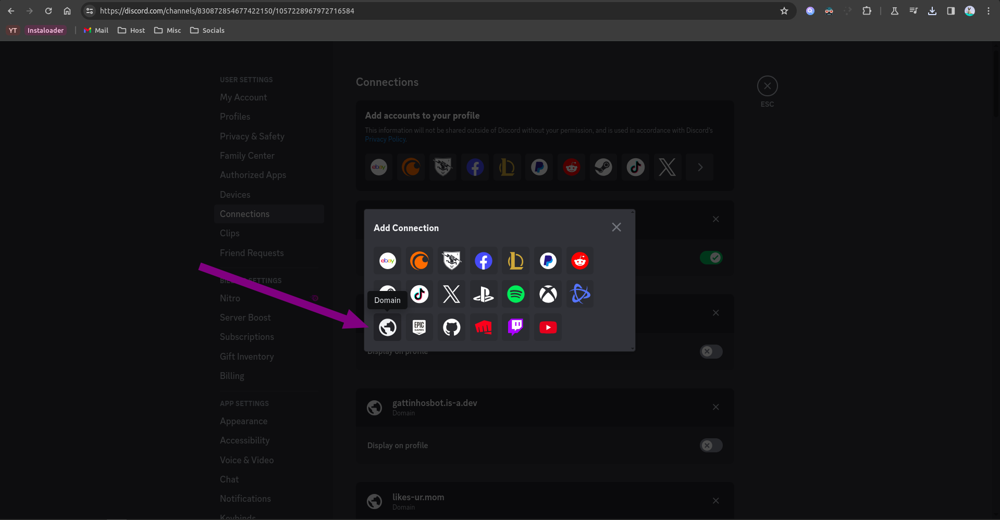

### Eits! Sebelumnya, Kamu harus fork repositori [is-a-dev/register](https://github.com/is-a-dev/register) dulu di GitHub. Abis itu baru mulai prosesnya

# Membuat koneksi domain untuk Discord, dengan subdomain is-a.dev

Ini adalah panduan tentang cara membuat koneksi subdomain is-a.dev kamu ke Discord

## Mendapatkan teks verifikasi
Note: di saat dokumentasi ini dibuat, opsi 'Bahasa Indonesia' tidak ditemukan di Discord. Jadi ini hanya untuk pengguna yang memakai bahasa 'English'

1. Buka aplikasi Discord kamu dan tekan `Settings`.
   

2. Buka  `Connections`.
   

3. Tekan `View more`.
   

4. Tekan tombol domain (yang ada icon globe).
   

5. Ketik subomain is-a.dev kamu di dalam kolom tersebut (misal, `example.is-a.dev`).
   

6. Ambil teks verifikasi tersebut (berada di kolom `Content`)
   

### Membuat file Domain

Masuk ke repositori yang sudah kamu fork sebelumnya

Buatlah sebuah file JSON baru di dalam directory `domains`, dengan nama `_discord.<nama subdomain kamu>.json` dengan format ini:

```json
{
    "owner": {
        "username": "<username GitHub kamu>",
        "email": "<email kamu>"
    },
    "record": {
        "TXT": "teks-verifikasi-discord"
    }
}
```

**Note:** Di bagian 'owner', kamu bisa menambahkan username social media kamu, seperti Discord. Jika kamu ingin menambahkan akun social media lagi, kamu bisa menghapus bagian 'email' di dalam file JSON tersebut. Tapi, kamu tetap diwajibkan untuk mencantumkan username Github kamu.

## Configuration

Setelah pull request kamu sudah tergabung, ulangi proses tersebut (tapi gausah ambil teks verifikasinya) sampai kamu pencet tombol `Verify`. Kalau ada error seperti `Unable to verify your domain`, coba tunggu beberapa menit (bisa sehari juga). Bisa jadi karena DNS nya belum ke-update