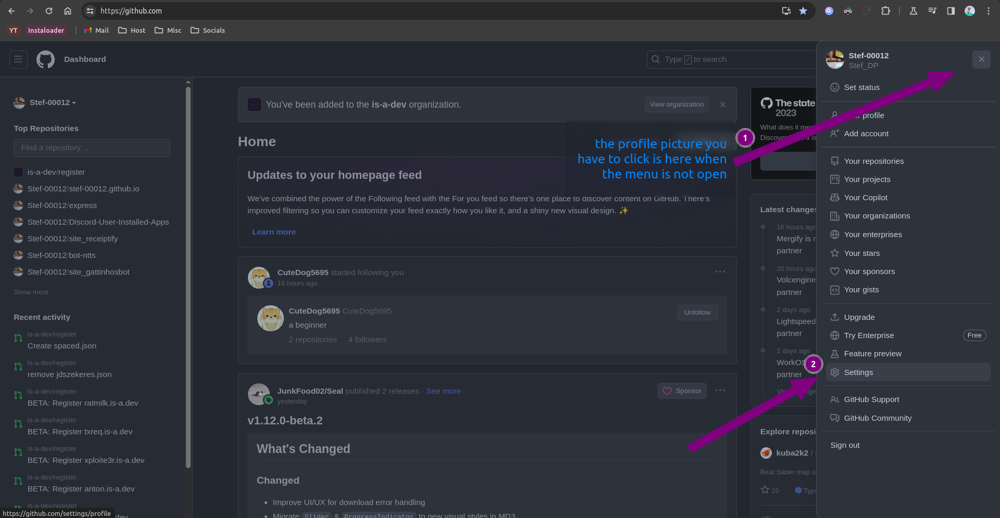
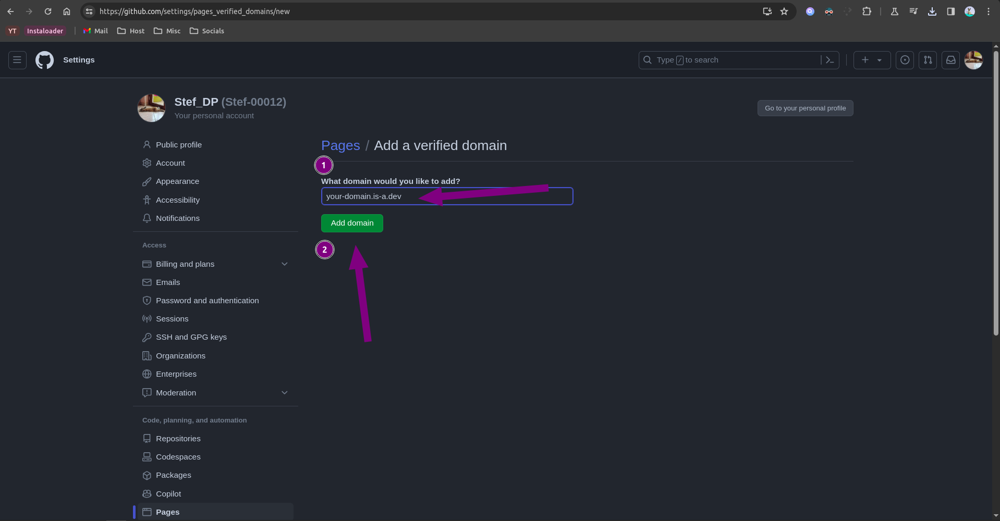

### Eits! Sebelumnya, Kamu harus fork repositori [is-a-dev/register](https://github.com/is-a-dev/register) dulu di GitHub. Abis itu baru mulai prosesnya

## Membuat GitHub Pages dengan subdomain is-a.dev

Ini adalah panduan tentang cara membuat website Github Pages dan mengarahkannya ke subdomain is-a.dev kamu

### Membuat repositori GitHub Pages

Pertama, kamu harus membuat website di Github Pages (ya pasti). Ikuti petunjuknya di [GitHub Pages Getting Started Guide](https://docs.github.com/en/pages/getting-started-with-github-pages) (bahasa Inggris).

### Membuat file Domain (Base)

Masuk ke repositori yang sudah kamu fork sebelumnya

Buat file JSON di dalam directory `domains` dan tambahkan `<subdomain kamu>.json` (Jangan lupa ganti `<subdomain kamu>` ya dengan nama subdomain yang kamu inginkan). Habis itu buat pull request:

```json
{
    "description": "Jelaskan kegunaan subdomain ini",
    "repo": "https://github.com/github-username/github-repositori-website-ini",
    "owner": {
        "username": "<username GitHub kamu>",
        "email": "<email kamu>"
    },
    "record": {
        "CNAME": "<username GitHub kamu>.github.io"
    }
}
```

### Configuring

- Setelah pull request sudah tergabung, kamu mungkin akan mendapatkan error **404** pada `<subdomain kamu>.is-a.dev` atau malah website yang salah 😔. Untuk memperbaiki ini, masuk ke repository website Github Pages kamu, terus buka **Settings > GitHub pages > Custom Domain** dan tambahkan `<subdomain kamu>.is-a.dev` di kolom yang tersedia. _Hanya lakukan ini **setelah** pull request kamu sudah tergabung._
- Klik **Enforce HTTPS** dibawah custom domain input
- Tunggu sebentar dan website mu sudah live!

## Verifikasi subdomain is-a.dev kamu dengan Github Pages

### Mengambil teks verifikasi

1. Buka GitHub, tekan profil kamu, dan tekan lagi tombol `Settings`.



2. Tekan `Pages`.


3. Tekan `Add a domain`.


4. Di kolom tersebut, ketik subdomain is-a.dev kamu (misal, `myname.is-a.dev`) dan tekan `Add domain`.



5. Copy hostname dan teks verifikasinya.


### Membuat file Domain (untuk verifikasi GitHub)

Masuk ke repositori yang sudah kamu fork sebelumnya

Buat file JSON baru di directory `domains` dengan nama `<hostname yang dicopy>.json` dengan hostname yang kamu copy di tahap 5. Dan taruh teks verifikasinya ke 'TXT'. Habis itu buatlah pull request:

```json
{
    "owner": {
        "username": "<username GitHub kamu>",
        "email": "<email kamu>"
    },
    "record": {
        "TXT": "teks-verifikasi-github"
    }
}
```

### Configuration

Setelah pull request kamu sudah tergabung, ulangi proses tersebut (tapi gausah ambil teks verifikasinya) sampai kamu pencet tombol `Verify`. Kalau ada error seperti `Unable to verify your domain`, coba tunggu beberapa menit (bisa sehari juga). Bisa jadi karena DNS nya belum ke-update
