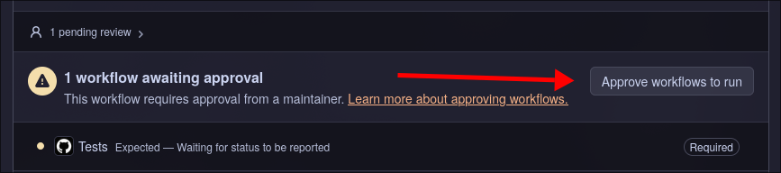
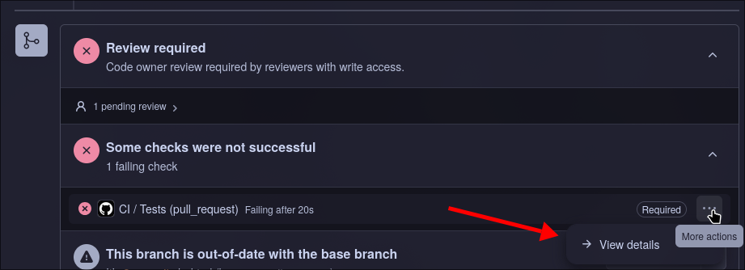
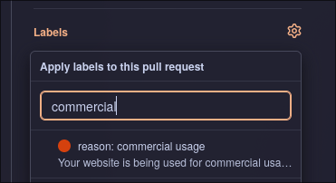
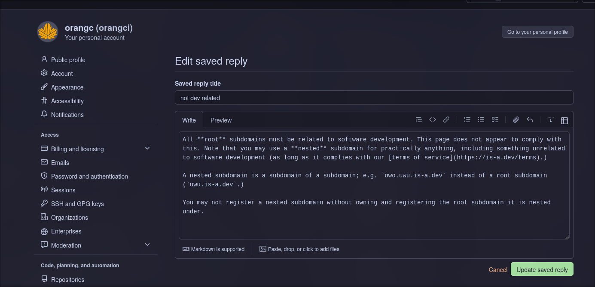

# Reviewing Pull Requests
Hello! Welcome to the is-a.dev maintainer team. This document is intended to get you up to speed with the pull request reviewing process.

First and most importantly, please read the [documentation](https://docs.is-a.dev). All of it. Seriously. It's important. Additionally, take a cursory glance over our [Terms of Service](https://is-a.dev/terms).

Let's begin.

## When to Instantly Close a PR
You should instantly close a pull request when:

1. The website has no preview provided *and* isn't accessible. We expect previews for *all* webpages.
2. The checkbox stating the user's agreement to our ToS has not been checked.
3. The PR is requesting NS records without a valid reason or without a reason provided at all. See [this page](https://docs.is-a.dev/faq/#who-can-use-ns-records) for details on what we consider a valid reason to request NS records.
4. The user violates our ToS in any way; e.g., if they are under thirteen years of age, if their webpage is breaking the law or hosting illegal content, cryptocurrency mining sites or tools, mass unsolicited emailing, impersonation without consent, et cetera.
5. The webpage is not related to software development. This does not apply for nested subdomains![^1]
5. Webpages who want to use our subdomain for commercial purposes. Including but not limited to *anything* with a "pricing plan" page. A portfolio stating that the user is available for hire is not considered commercial usage.
6. The user breaks GitHub's [Terms of Service](https://docs.github.com/en/site-policy/github-terms/github-terms-of-service).
7. The PR is a duplicate of another PR (i.e., the user made multiple PRs in the hopes of getting their domain faster).
8. Any one the "Requirements" checkboxes have not been fulfilled.

## Steps to Reviewing a PR
First, approve checks. Do this by clicking the button at the bottom of the PR labelled "Approve workflows to run".

Now, check the preview (if applicable) or attempt to access the website based on the DNS records in the JSON file (in the "Files changed" tab at the top of the pull request). Now, judge if it should be closed based on the above "When to Instantly Close a PR".

You cannot merge a PR if the checks do not pass. If the checks fail, examine the JSON file(s) and their respective filename(s) and/or the "View details" button under the menu which itself is under the "Some checks were not successful" message.

*Request changes* based on the issues at hand. Do not be rude in your review and act professionally.

If there are no issues with the PR at this point, you are free to merge it.
If you requested changes, please *apply labels to the PR*. For example, if the PR violates our ToS because it is a commercial website:

## Tips & Tricks
1. Use GitHub's saved replies feature to speed up reviewing. You can create and edit saved replies [here](https://github.com/settings/replies). Here's an example:

You can use quickly select and use saved replies in the reply/reviewing text box by pressing Ctrl/Command + Period (.) together.

2. Mass approve checks first, review afterwards. This allows you to skip the hassle of waiting for checks to finish running.

3. When unsure of whether or not to approve or request changes on a PR, do not hesitate to ask another, more experienced maintainer on how to deal with it. You can also simply skip the PR and wait for someone else to review it.

[^1]: Nested subdomains are a subdomain of a subdomain, such as `nested.orangc.is-a.dev`. `orangc.is-a.dev` is not a nested subdomain, it is a subdomain!