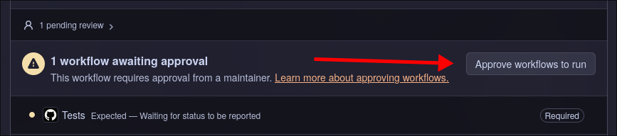
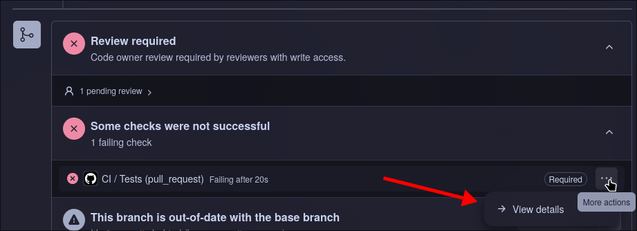
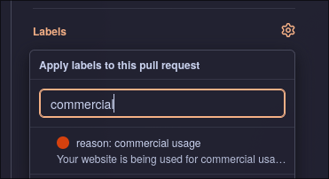
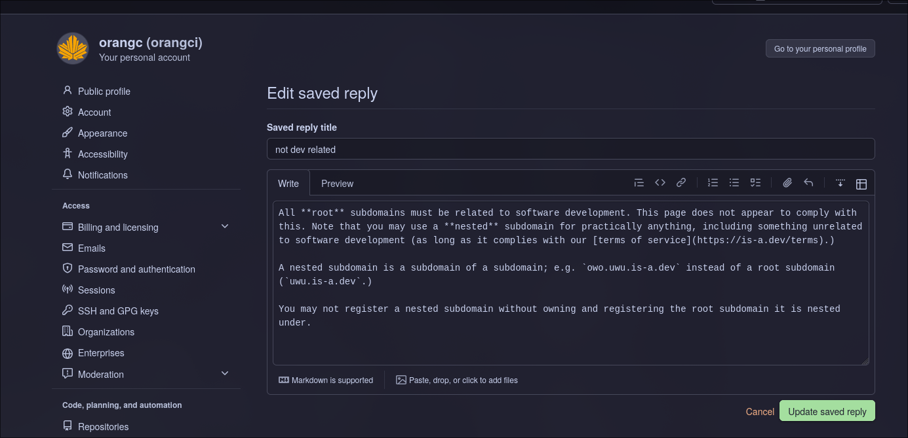
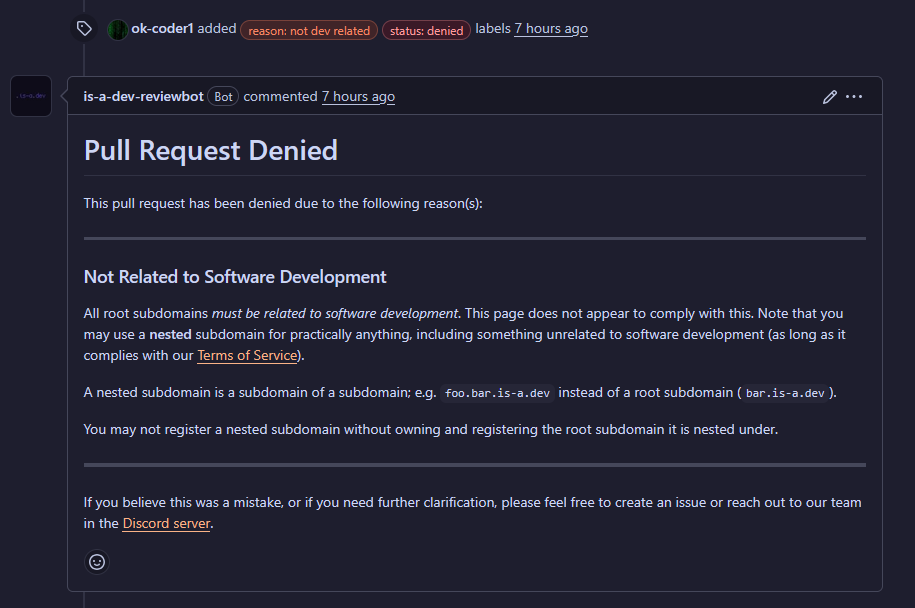

# Reviewing Pull Requests
Hello! Welcome to the is-a.dev maintainer team. This document is intended to get you up to speed with the pull request reviewing process.

First and most importantly, please read the [documentation](https://docs.is-a.dev). All of it. Seriously. It's important. Additionally, take a cursory glance over our [Terms of Service](https://is-a.dev/terms).

Let's begin.

## When to Instantly Close a PR
You should instantly close a pull request when:

1. The website has no preview provided *and* isn't accessible. We expect previews for *all* webpages.
2. The checkbox stating the user's agreement to our [ToS](https://is-a.dev/terms) (Terms of Service) has not been checked.
3. The PR is requesting NS records without a valid reason or without a reason provided at all. See [this page](https://docs.is-a.dev/faq/#who-can-use-ns-records) for details on what we consider a valid reason to request NS records.
4. The user violates our ToS in any way; e.g., if they are under thirteen years of age, if their webpage is breaking the law or hosting illegal content, cryptocurrency mining sites or tools, impersonation without consent, et cetera.
5. The webpage is not related to software development. This does not apply for nested subdomains![^1]
6. Webpages who want to use our subdomain for commercial purposes. Including but not limited to *anything* with a "pricing plan" page. A portfolio stating that the user is available for hire is not considered commercial usage.
7. The user breaks GitHub's [Terms of Service](https://docs.github.com/en/site-policy/github-terms/github-terms-of-service).
8. The PR is a duplicate of another PR (i.e., the user made multiple PRs in the hopes of getting their domain faster).
9. Any one the "Requirements" checkboxes have not been fulfilled.

[^1]: Nested subdomains are a subdomain of a subdomain, such as `nested.example.is-a.dev`. `example.is-a.dev` is not a nested subdomain, it is a subdomain!

## Steps to Reviewing a PR
First, approve checks if needed. Do this by clicking the button at the bottom of the PR labelled "Approve workflows to run".

Now, check the preview (if applicable) or attempt to access the website based on the DNS records in the JSON file (in the "Files changed" tab at the top of the pull request). Now, judge if it should be closed based on the above "When to Instantly Close a PR".

You cannot merge a PR if the checks do not pass. If the checks fail, examine the JSON file(s) and their respective filename(s) and/or the "View details" button under the menu which itself is under the "Some checks were not successful" message.

*Request changes* based on the issues at hand. Do not be rude in your review and act professionally. We recommend using reviewbot to streamline the process of requesting changes!

If there are no issues with the PR at this point, you are free to merge it.
If you requested changes, please *apply labels to the PR*. For example, if the PR violates our ToS because it is a commercial website:

## Tips & Tricks
1. Use GitHub's saved replies feature to speed up reviewing. You can create and edit saved replies [here](https://github.com/settings/replies). Here's an example:

You can use quickly select and use saved replies in the reply/reviewing text box by pressing Ctrl/Command + Period (.) together.

We recommend using reviewbot instead of saved replies, however! See the next section.

2. Mass approve checks first, review afterwards. This allows you to skip the hassle of waiting for checks to finish running.

3. When unsure of whether or not to approve or request changes on a PR, do not hesitate to ask another, more experienced maintainer on how to deal with it. You can also simply skip the PR and wait for someone else to review it.

## Reviewbot
A very helpful tool we have at our disposal is [reviewbot](https://github.com/iostpa/reviewbot). Reviewbot is a GitHub bot maintained by [iostpa](https://iostpa.com) which sends a comment in a pull request upon the application of labels with an explanation of each label in some detail. Reviewbot can also optionally close a pull request based on the `status: denied` label.

Example usage would be as follows: on a pull request that adds a website unrelated to software development, you should add the `status: denied` and `reason: not dev related` labels to the pull request, and simply move on. Reviewbot will close the pull request on your behalf and explain the reason why the pull request was denied in detail to the PR author. 

!!!
Note: You may use `status: invalid` to simply request changes on a PR instead of closing it.
!!!

Please use `status: denied` or `status: invalid` in conjuction with other `reason: x` labels (or `status: needs preview`). If none of the labels fit the reason why you denied the pull request, use `reason: other` in conjuction with either status label and comment your reason directly in the pull request.

!!!
Reviewbot has a 3 second time window. This means that you can make last-minute changes before reviewbot starts sending the message.
!!!

Here is an example of using reviewbot with the `status: denied` and `reason: not dev related` labels:

